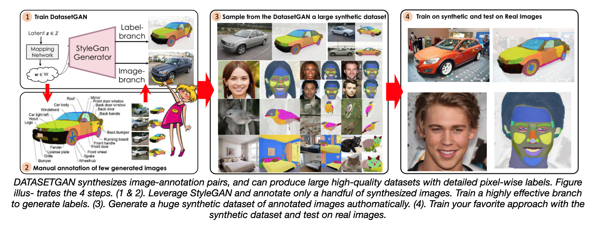
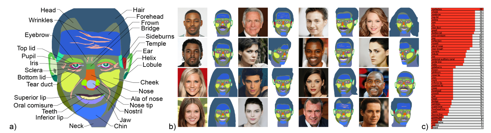
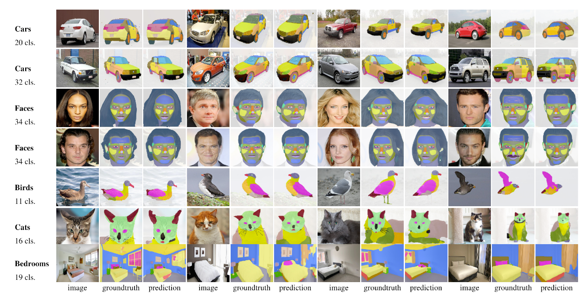
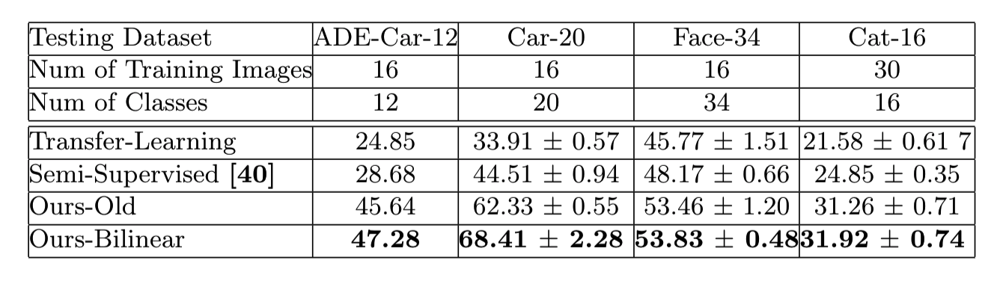

# DatasetGAN

This is the official code and data release for:

#### DatasetGAN: Efficient Labeled Data Factory with Minimal Human Effort

<sup>[Yuxuan Zhang*](https://www.alexyuxuanzhang.com/), [Huan Ling*](http://www.cs.toronto.edu/~linghuan/), [Jun Gao](http://www.cs.toronto.edu/~jungao/), [Kangxue Yin](https://kangxue.org/), [Jean-Francois Lafleche](), [Adela Barriuso](), [Antonio Torralba](https://groups.csail.mit.edu/vision/torralbalab/), [Sanja Fidler](http://www.cs.toronto.edu/~fidler/)<sup>

**CVPR'21, Oral** **[[paper](https://arxiv.org/abs/2104.06490)] [[supplementary](https://drive.google.com/file/d/1td1nP8FP0axHXFxl9_EXCtHQHhnaUQl8/view?usp=sharing)] [[Project Page](https://nv-tlabs.github.io/datasetGAN/)]**



## News

- Benchmark Challenge - A benchmark with diversed testing images is coming soon -- stay tuned!

- Generated dataset for downstream tasks is coming soon -- stay tuned!

## License

For any code dependency related to Stylegan, the license is under the [Creative Commons BY-NC 4.0](https://creativecommons.org/licenses/by-nc/4.0/) license by NVIDIA Corporation.  To view a copy of this license, visit [LICENSE](https://github.com/NVlabs/stylegan/blob/master/LICENSE.txt ).

The code of DatasetGAN is released under the MIT license. See [LICENSE](https://github.com/nv-tlabs/datasetGAN_release/blob/release_finallll/LICENSE.txt) for additional details.

The dataset of DatasetGAN is released under the [Creative Commons BY-NC 4.0](https://creativecommons.org/licenses/by-nc/4.0/) license by NVIDIA Corporation. You can **use, redistribute, and adapt** the material for **non-commercial purposes**, as long as you give appropriate credit by **citing our paper** and **indicating any changes** that you've made.

## Requirements

- Python 3.6  is supported.
- Pytorch 1.4.0.
- This code is tested with CUDA 10.1 toolkit and CuDNN 7.5.
- All results in our paper are based on Nvidia Tesla V100 GPUs with 32GB memory. 
- Please check the python package requirement from [`requirements.txt`](requirements.txt), and install using
```
pip install -r requirements.txt
```

- *Download Dataset from [google drive](https://drive.google.com/drive/folders/1Oa9XpyKnRSN5s9-ab2-5j3wvH374JOu8?usp=sharing)* and put it in the folder of ***./datasetGAN/dataset_release***.  Please be aware that the dataset of DatasetGAN is released under the [Creative Commons BY-NC 4.0](https://creativecommons.org/licenses/by-nc/4.0/) license by NVIDIA Corporation.

- *Download pretrained checkpoint from [Stylegan](https://github.com/NVlabs/stylegan) and convert the tensorflow checkpoint to pytorch. We also release the [pytorch checkpoint](https://drive.google.com/drive/folders/1Hhu8aGxbnUtK-yHRD9BXZ3gn3bNNmsGi?usp=sharing)  for your convenience. Put checkpoints in the folder of **./checkpoint/stylegan_pretrain***. Please be aware that the any code dependency and checkpoint related to Stylegan, the license is under the [Creative Commons BY-NC 4.0](https://creativecommons.org/licenses/by-nc/4.0/) license by NVIDIA Corporation.  

## Training 

To reproduce paper **DatasetGAN: Efficient Labeled Data Factory with Minimal Human Effort**: 

```
cd datasetGAN
```

1. Run **Step1: Interpreter training**.  
3. Run **Step2: Sampling** to generate massive annotation-image dataset.
4. Run **Step3: Train Downstream Task**.


#### 1. Interpreter Training 

```
python train_interpreter.py --exp experiments/<exp_name>.json 
```

Note: Training time for 16 images is around one hour. 160G RAM is required to run 16 images training. One can cache the data returned from **prepare_data** function to disk but it will increase trianing time due to I/O burden. 

*Example of annotation schema for Face class. Please refer to paper for other classes.*



Download [Checkpoints](https://drive.google.com/drive/folders/1Hhu8aGxbnUtK-yHRD9BXZ3gn3bNNmsGi?usp=sharing)

#### 2. Run GAN Sampling  

```
python train_interpreter.py \
--generate_data True --exp experiments/<exp_name>.json  \
--resume [path-to-trained-interpreter in step3] \
--num_sample [num-samples]
```
To run sampling processes in parallel
```
sh datasetGAN/script/generate_face_dataset.sh
```

*Example of sampling images and annotation:*


#### 3. Train Downstream Task  

```
python train_deeplab.py \
--data_path [path-to-generated-dataset in step4] \
--exp experiments/<exp_name>.json
```

## Inference




```
python test_deeplab_cross_validation.py --exp experiments/face_34.json\
--resume [path-to-downstream task checkpoint] --cross_validate True
```

**June 21st Update:**

For training interpreter, we change the upsampling method from nearnest upsampling to bilinar upsampling in [line](https://github.com/nv-tlabs/datasetGAN_release/blob/release_finallll/datasetGAN/train_interpreter.py#L163) and update results in Table 1.  The table reports mIOU.



## Citations

Please ue the following citation if you use our data or code: 

```
@inproceedings{zhang2021datasetgan,
  title={Datasetgan: Efficient labeled data factory with minimal human effort},
  author={Zhang, Yuxuan and Ling, Huan and Gao, Jun and Yin, Kangxue and Lafleche, Jean-Francois and Barriuso, Adela and Torralba, Antonio and Fidler, Sanja},
  booktitle={Proceedings of the IEEE/CVF Conference on Computer Vision and Pattern Recognition},
  pages={10145--10155},
  year={2021}
}
```

